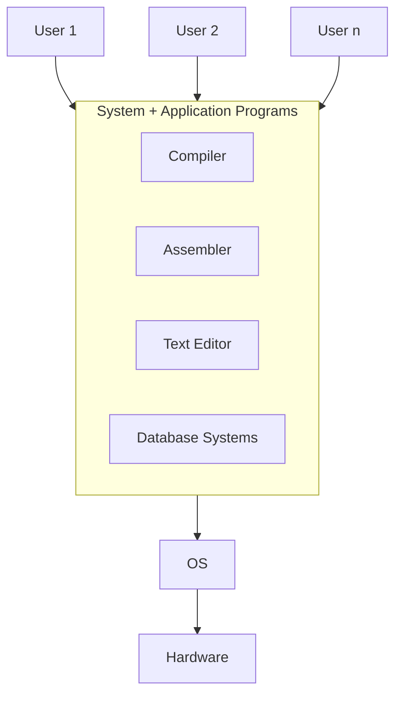
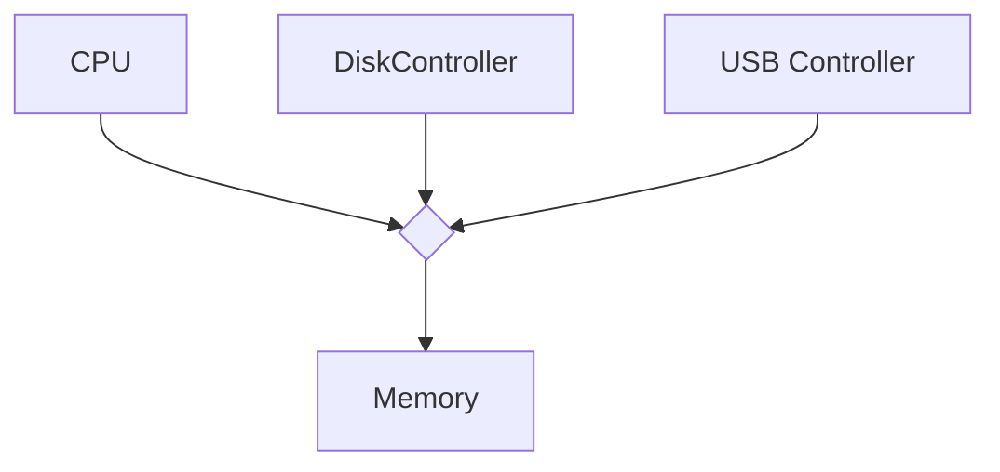

# Four Components of a Computer System

# Operating System
OS: A program that acts as an intermediary between user and hardware
- Users want **ease of use**, **good performance**
- Shared computers (mainframe of minicomputer) must keep all users happy
- Dedicated systems (workstation) have dedicated resources but frequently use shared resources from servers

OS is a **resource allocator**
* Manages all resources
* Decides between conflicting requests for efficient + fair resource use

OS is a **control program**
* Controls execution of programs to prevent errors + improper use of computer

# Kernel
The one program that is running at all times.

# Computer System Organization
For 1 or more CPUs, device controllers connect through common bus, providing access to shared memories
* Concurrent execution of CPUs + devices competing for memory cycles

# Key Interfaces
* API
* ABI - application binary interface
* Instruction set architecture (ISA?)

# Computer Startup
* Bootstrap program is loaded at power-up
	* Typically stored in ROM or EPROM (Erasable Programmable ROM, **firmware**)
	* Initializes all aspects of system
	* Loads + executes OS kernel

# Interrupts
* Interrupts transfer control to the interrupt service routine through the interrupt vector
* Interrupt architecture must save...
#todo-fill-in-notes

# Evolution of OS
1. Serial Processing
	1. No OS, punch cards
	2. Directly interacted with hardware
	3. Display lights + toggle switches
	4. Users have access to computer in series
	5. Signup sheet for programming time
2. Simple Batch Systems
	1. Programmer converts cards to tape
	2. Operator computes tape batch jobs
	3. Operator converts tape to output
