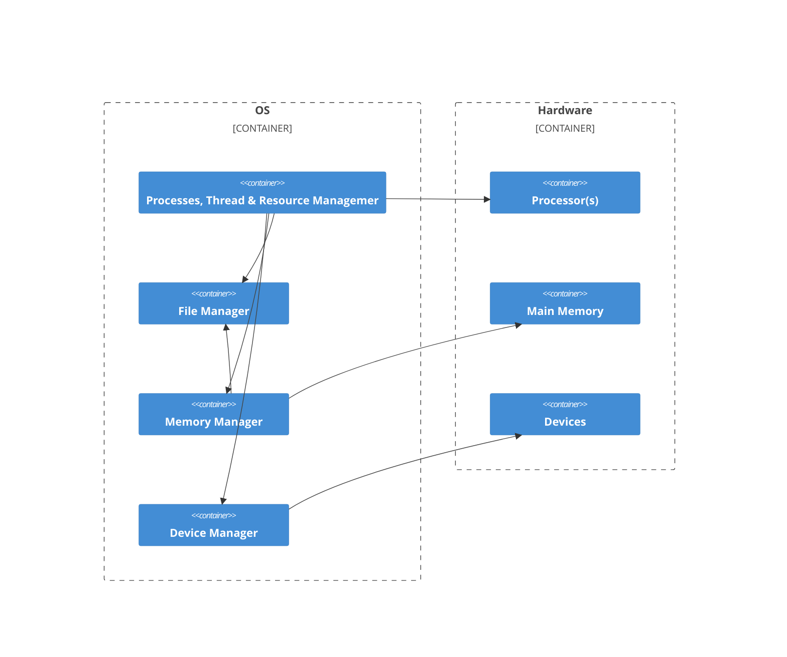

# Purpose of an OS
* Create abstractions and coordinate the use of such abstractions

# Basic OS Organization

# Kernel vs User Mode
### Kernel Mode
* Executing code has complete + unrestricted access to underlying hardware
* Is reserved for the lowest-level, trusted functions of OS
* Crashes are **catastrophic**
* eg, editing SSH
### User Mode
* Executing code cannot directly access hardware
* Code must delegate to system APIs to access hardware
* Crashes are recoverable
* eg, using SSH
