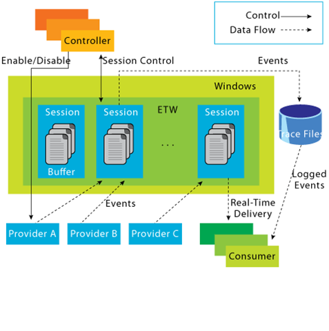

# Event Tracing for Windows (ETW)

Event Tracing For Windows (ETW) is a general-purpose, high-speed tracing facility provided by the operating system. Using a buffering and logging mechanism implemented in the kernel, ETW provides a tracing mechanism for events raised by both user-mode applications and kernel-mode device drivers.



## Interacting With ETW

`Logman` is a pre-installed utility for managing Event Tracing for Windows (ETW) and Event Tracing Sessions. This tool is invaluable for creating, initiating, halting, and investigating tracing sessions. This is particularly useful when determining which sessions are set for data collection or when initiating your own data collection.

`-ets` parameter: allow for a direct investigation of the event tracing sessions, providing insights into system-wide tracing sessions

```
logman.exe query -ets
logman.exe query providers [generates list of all providers]
```

## Providers

Providers play a pivotal role in generating events and writing them to the designated ETW sessions. Applications have the ability to register ETW providers, enabling them to generate and transmit numerous events.

- `Microsoft-Windows-Kernel-Process`: This ETW provider is
  instrumental in monitoring process-related activity within the Windows kernel. It can aid in detecting unusual process behaviors such as process injection, process hollowing, and other tactics commonly used by malware and advanced persistent threats (APTs).
- `Microsoft-Windows-Kernel-File`: As the name suggests, this provider focuses on file-related operations. It can be employed for detection scenarios involving unauthorized file access, changes to critical system files, or suspicious file operations indicative of exfiltration or ransomware activity
- `Microsoft-Windows-Kernel-Network`: This ETW provider offers visibility into network-related activity at the kernel level. It's especially useful in detecting network-based attacks such as data exfiltration, unauthorized network connections, and potential signs of command and control (C2) communication
- `Microsoft-Windows-SMBClient/SMBServer`: These providers monitor Server Message Block (SMB) client and server activity, providing insights into file sharing and network communication. They can be used to detect unusual SMB traffic patterns, potentially indicating lateral movement or data exfiltration
- `Microsoft-Windows-DotNETRuntime`: This provider focuses on .NET runtime events, making it ideal for identifying anomalies in .NET application execution, potential exploitation of .NET vulnerabilities, or malicious .NET assembly loading.
- `OpenSSH`: Monitoring the OpenSSH ETW provider can provide important insights into Secure Shell (SSH) connection attempts, successful and failed authentications, and potential brute force attacks.
- `Microsoft-Windows-VPN-Client`: This provider enables tracking of Virtual Private Network (VPN) client events. It can be useful for identifying unauthorized or suspicious VPN connections.
- `Microsoft-Windows-PowerShell`: This ETW provider tracks PowerShell execution and command activity, making it invaluable for detecting suspicious PowerShell usage, script block logging, and potential misuse or exploitation.
- `Microsoft-Windows-Kernel-Registry`: This provider monitors registry operations, making it useful for detection scenarios related to changes in registry keys, often associated with persistence mechanisms, malware installation, or system configuration changes.
- `Microsoft-Windows-CodeIntegrity`: This provider monitors code and driver integrity checks, which can be key in identifying attempts to load unsigned or malicious drivers or code.
- `Microsoft-Antimalware-Service`: This ETW provider can be employed to detect potential issues with the antimalware service, including disabled services, configuration changes, or potential evasion techniques employed by malware.
- `WinRM`: Monitoring the Windows Remote Management (WinRM) provider can reveal unauthorized or suspicious remote management activity, often indicative of lateral movement or remote command execution.
- `Microsoft-Windows-TerminalServices-LocalSessionManager`: This provider tracks local Terminal Services sessions, making it useful for detecting unauthorized or suspicious remote desktop activity.
- `Microsoft-Windows-Security-Mitigations`: This provider keeps tabs on the effectiveness and operations of security mitigations in place. It's essential for identifying potential bypass attempts of these security controls.
- `Microsoft-Windows-DNS-Client`: This ETW provider gives visibility into DNS client activity, which is crucial for detecting DNS-based attacks, including DNS tunneling or unusual DNS requests that may indicate C2 communication.
- `Microsoft-Antimalware-Protection`: This provider monitors the operations of antimalware protection mechanisms. It can be used to detect any issues with these mechanisms, such as disabled protection features, configuration changes, or signs of evasion techniques employed by malicious actors.
